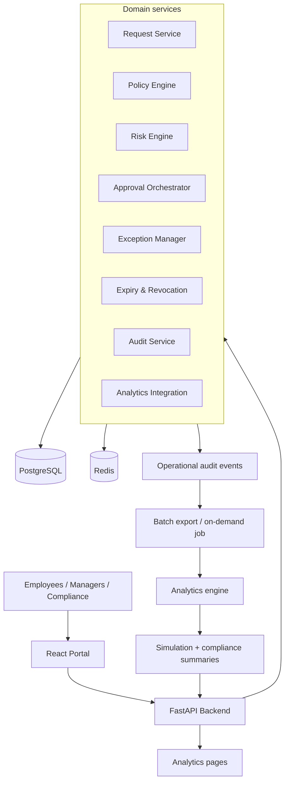
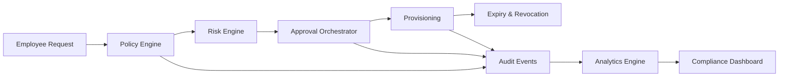
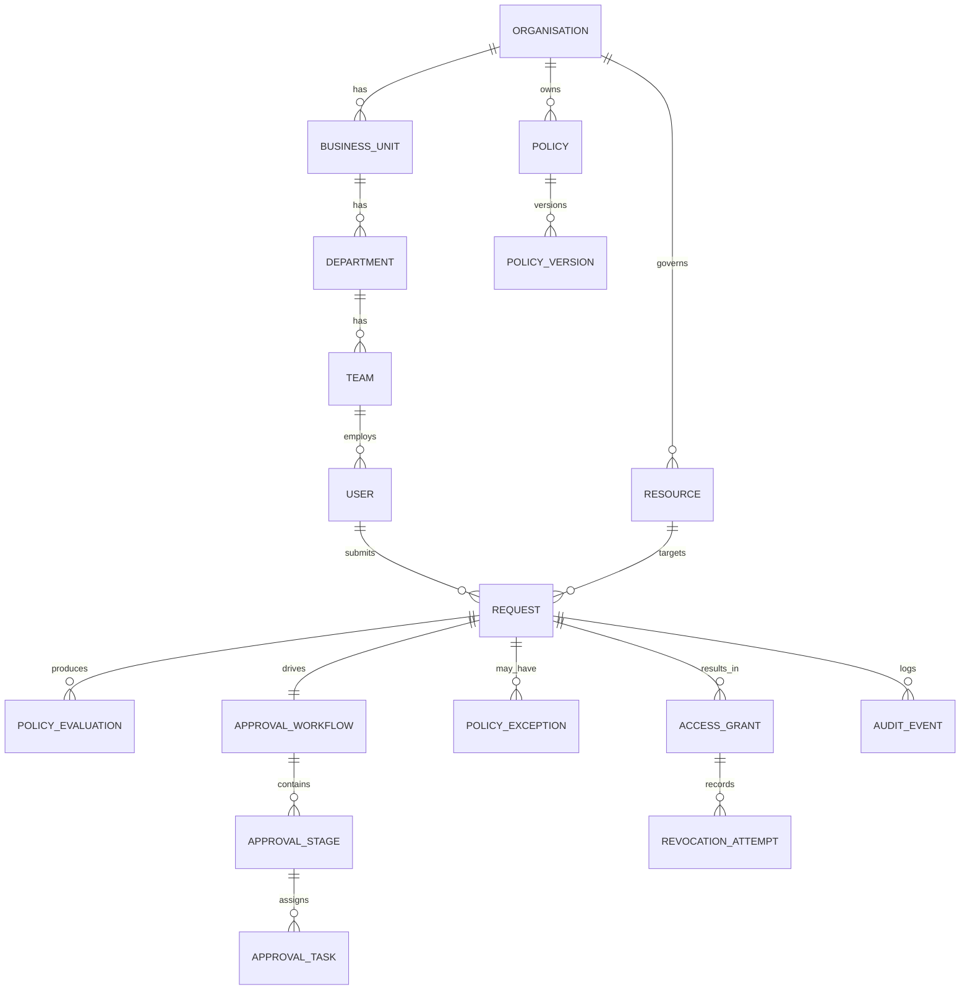
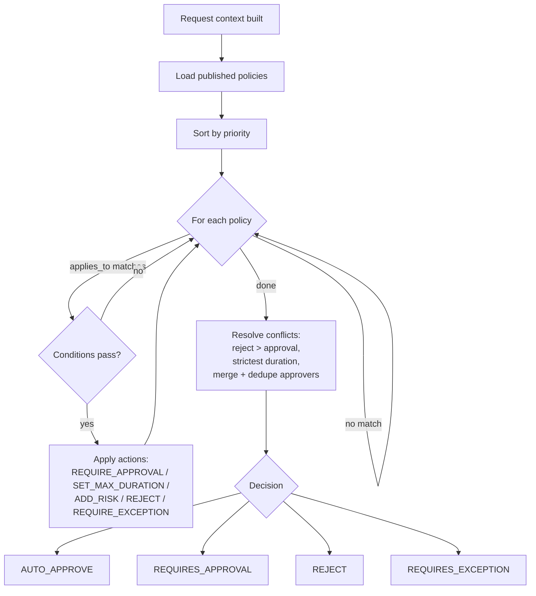
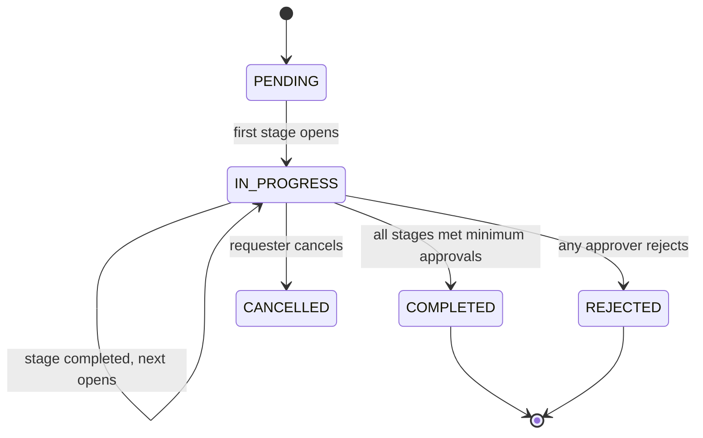
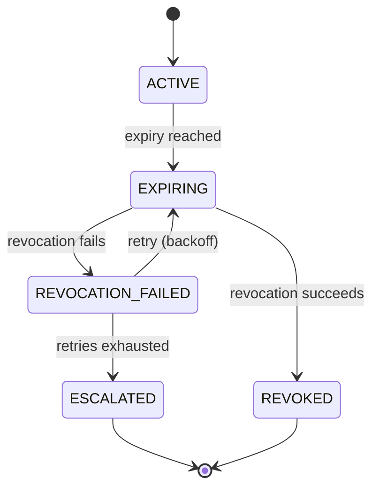

# OpsPolicy

**Enterprise Policy, Approval, Exception, and Compliance Management Platform**

OpsPolicy centralises the operational rules that large organisations otherwise
scatter across email, chat, tickets, and spreadsheets. Employees submit
operational requests; a **deterministic policy engine** evaluates them; the
system routes them through **configurable approval workflows**; temporary
exceptions and access grants **expire automatically**; and compliance teams
analyse organisational behaviour through an analytical engine that runs *behind*
the platform.

The core operational platform never depends on the analytics engine for a
synchronous decision. Policy evaluation, approvals, provisioning, and revocation
all keep working even when analytics is offline.

> **Note on this repo:** the full project structure, models, schemas, API
> routes, and tests are included below. The core decision logic inside the
> policy engine, risk engine, approval/exception services, provisioning
> lifecycle, workflow builder, and policy simulation is left as `# TODO`
> rather than filled in, so the architecture and design are fully visible
> without the runnable implementation.

---

## Enterprise problem statement

Operational rules like *"production admin access needs manager and security
approval"*, *"contractors get at most seven days"*, or *"purchases over ₹10 lakh
need finance and the department head"* are real policies, but they usually live
in people's heads and inboxes. That means inconsistent enforcement, no audit
trail, access that outlives its purpose, and no way to ask *"what would happen if
we tightened this rule?"* before rolling it out.

OpsPolicy makes those rules executable, explainable, and auditable.

---

## Features

- **Deterministic policy engine** — structured JSON rules, ten operators,
  nested `all`/`any`/`not` groups, priority ordering, and explicit conflict
  resolution. No arbitrary code, ever.
- **Transparent risk scoring** — every request gets a score with a full factor
  breakdown, banded LOW / MEDIUM / HIGH / CRITICAL.
- **Configurable approval workflows** — sequential and parallel stages, minimum
  approvals, role resolution, delegation, SLA deadlines, escalation, and
  conflict-of-interest prevention (no self-approval).
- **Temporary exceptions** — justified, time-bound overrides with compensating
  controls that expire on their own.
- **Automatic expiry and revocation** — background workers revoke access on
  expiry, retry with backoff, and escalate on repeated failure.
- **Immutable audit history** — append-only events and an ordered per-request
  timeline.
- **Historical policy simulation** — run a proposed policy against past requests
  to see its impact before publishing.
- **Compliance analytics** — organisation-wide metrics surfaced inside the
  platform, with data-freshness and stale states.

---

## Architecture



The analytics engine (Databricks Free Edition in the reference deployment) sits
behind an `AnalyticsProvider` interface. A `MockAnalyticsProvider` runs locally
with no external account; a `DatabricksAnalyticsProvider` is used in a real
deployment. The product surface never names the analytics vendor.

### End-to-end lifecycle



---

## Database entity relationships



Two correctness rules are enforced at the model level: **policy versions are
immutable** (a change creates a new version, and every evaluation stores the
exact version it used, so historical explanations never drift), and **access
grants carry a uniqueness constraint** on
`(request_id, grant_type, resource_id, user_id)` so provisioning is idempotent.

---

## Policy-evaluation flow



The engine is a pure function: the same inputs always yield the same decision,
which is what makes historical simulation trustworthy.

---

## Approval-workflow flow



Stages run **sequentially** or in **parallel** with a configurable minimum
number of approvals. Approval actions are **idempotent** — each carries an
`operation_id`, and entities use optimistic locking (`lock_version`) so two
approvers acting on the same task commit only one valid transition.

---

## Access-expiry and revocation flow



Retry backoff is configurable (`REVOCATION_RETRY_DELAYS`, default `60,300,900`
seconds) so demonstrations run quickly. Only one worker processes a grant at a
time; successful revocation is terminal; escalation opens a compliance incident;
every attempt writes an audit event.

---

## Analytics integration flow

```mermaid
flowchart LR
    PG[(PostgreSQL)] --> EXP[Incremental export]
    EXP --> FILES[JSON / Parquet + manifest]
    FILES --> VOL[Unity Catalog Volume]
    VOL --> ING[Ingestion notebook]
    ING --> BRONZE[Bronze Delta tables]
    BRONZE --> SILVER[Silver: clean + enrich]
    SILVER --> GOLD[Gold: compliance summaries]
    GOLD --> BE[Backend reads result]
    BE --> UI[Analytics pages]
```



If analytics is unavailable: request submission, evaluation, approvals,
provisioning, and revocation all continue. Analytics pages show a stale-data
warning; new simulations queue or fail gracefully.

---

## Technology stack

| Layer | Choice |
| --- | --- |
| API | Python 3.12, FastAPI, Pydantic 2 |
| Persistence | PostgreSQL, SQLAlchemy 2, Alembic |
| Cache / queues / scheduling | Redis |
| Workers | Python background runner |
| Frontend | React 18, TypeScript, Vite, TanStack Query, React Router, Tailwind, Recharts |
| Analytics | Databricks Free Edition (behind an interface; mock provider for local) |
| Tests | Pytest |
| Runtime | Docker, Docker Compose |

---

## Setup

### Run everything with Docker

```bash
cp .env.example .env
docker compose up --build
```

This starts:

| Service | URL |
| --- | --- |
| Frontend | http://localhost:5173 |
| Backend | http://localhost:8000 |
| API docs (Swagger) | http://localhost:8000/docs |
| PostgreSQL | localhost:5432 |
| Redis | localhost:6379 |
| Worker + scheduler | (background) |

The backend container runs migrations and seeds the demo organisation on start.

### Common commands

```bash
# Apply migrations
docker compose exec backend alembic upgrade head

# Seed the Northstar Enterprises demo org
docker compose exec backend python -m app.seed

# Run the test suite
docker compose exec backend pytest -q
```

### Run the backend locally without Docker

```bash
cd backend
python -m venv .venv && source .venv/bin/activate
pip install -r requirements.txt
export DATABASE_URL="sqlite:///./app.db"   # or a Postgres URL
python -m app.seed
uvicorn app.main:app --reload
```

The platform runs on SQLite for quick local work; PostgreSQL is the deployment
target.

---

## Seed users

All seeded users share the password **`opspolicy123`**.

| Email | Name | Role |
| --- | --- | --- |
| `admin@northstar.io` | Aisha Rao | Platform Admin |
| `lena@northstar.io` | Lena Fernandes | Employee (analyst / requester) |
| `omar@northstar.io` | Omar Sheikh | Employee (engineer) |
| `sam.contractor@northstar.io` | Sam Wright | Employee (contractor) |
| `arjun.mgr@northstar.io` | Arjun Iyer | Manager |
| `kabir.owner@northstar.io` | Kabir Sen | Data Owner |
| `rahul.sec@northstar.io` | Rahul Verma | Security Reviewer |
| `ishaan.comp@northstar.io` | Ishaan Malhotra | Compliance Officer |
| `nikhil.fin@northstar.io` | Nikhil Jain | Finance Reviewer |
| `vikram.head@northstar.io` | Vikram Shah | Department Head |

---

## Demo scenarios

1. **Restricted dataset access** — Lena requests 30-day export access to
   `customer_profiles` (RESTRICTED) to the US. The engine returns
   `REQUIRES_APPROVAL`, CRITICAL risk, data-owner + compliance approvals,
   duration capped at 7 days, and two violations. **Fully live**: submit it on
   **New request**, then watch it land on **My requests** as UNDER REVIEW with a
   generated data-owner + compliance workflow and a complete audit timeline.
   Once approved, provision it from the **Access lifecycle** tab to create a
   time-bound grant that the background worker revokes automatically at expiry.
2. **Emergency production access** — an engineer requests emergency admin access;
   manager + security approve; access is capped to a short window and expires
   automatically. *(Lifecycle milestone.)*
3. **High-value purchase** — a ₹12 lakh purchase triggers parallel finance +
   department-head approval. Approvers act from the **Approval inbox**;
   decisions are idempotent and optimistically locked. *(SLA escalation worker:
   Milestone 4 remainder.)*
4. **Revocation failure** — a simulated failure retries with configurable
   backoff (`REVOCATION_RETRY_DELAYS`) and escalates to a compliance incident
   once retries are exhausted. **Live**: the revocation attempts and their
   outcomes show on the request's **Access lifecycle** tab. *(Escalation
   dashboard metric: analytics milestone.)*
5. **Policy simulation** — a proposed *"contractor production access expires
   within seven days"* rule is run against historical requests, re-evaluating
   each with the same deterministic engine. **Live** on the **Policy simulation**
   page: it reports requests analysed, affected, previously-approved-now-changed,
   duration reductions, most-affected teams, and a rollout recommendation.

6. **Policy exception** — a CRITICAL-risk restricted export that policy would
   block can be granted a temporary, justified override with compensating
   controls. **Live**: request it from the request's Summary tab; because the
   request is high-risk, only a security or compliance reviewer can approve it,
   and it activates immediately with a hard expiry (a worker expires it
   automatically — no permanent exceptions).

---

## Policy-engine design

Policies are structured JSON, never code:

```json
{
  "name": "Restricted dataset export",
  "applies_to": { "request_type": "DATASET_ACCESS" },
  "conditions": {
    "all": [
      { "field": "resource.sensitivity", "operator": "EQUALS", "value": "RESTRICTED" },
      { "field": "request.requested_action", "operator": "EQUALS", "value": "EXPORT" }
    ]
  },
  "actions": [
    { "type": "REQUIRE_APPROVAL", "role": "DATA_OWNER", "stage": 1 },
    { "type": "REQUIRE_APPROVAL", "role": "COMPLIANCE_OFFICER", "stage": 2 },
    { "type": "SET_MAXIMUM_DURATION", "days": 7 },
    { "type": "ADD_RISK", "points": 8, "reason": "Restricted dataset export" }
  ]
}
```

**Operators:** `EQUALS`, `NOT_EQUALS`, `IN`, `NOT_IN`, `GREATER_THAN`,
`GREATER_THAN_OR_EQUAL`, `LESS_THAN`, `LESS_THAN_OR_EQUAL`, `CONTAINS`,
`IS_NULL`, `IS_NOT_NULL`. **Condition groups:** `all`, `any`, `not`.

**Conflict resolution:** explicit rejection beats auto-approval; the strictest
maximum duration wins; approvers from multiple policies are merged and deduped
per stage; higher-risk policies can add stages; conflicts are surfaced in the
result.

---

## Failure-recovery design

- **Idempotent everything** — approvals (`operation_id`), provisioning (unique
  grant key), revocation (single-worker + terminal success), notifications
  (dedupe key).
- **Optimistic locking** on requests, workflows, tasks, and grants prevents
  stale-version writes and double transitions.
- **Explicit state machines** reject invalid transitions with a structured
  error rather than corrupting state.
- **Analytics isolation** — the analytics provider is behind an interface, and
  its failure never marks the core service unhealthy (`/health/ready` reports it
  separately).

---

## Testing

```bash
cd backend && pytest -q
```

Current suites cover the deterministic engine (operators, nested groups,
conflict resolution, decisions), risk scoring and banding, state-transition
validation, the full request-submission lifecycle, the approval decision engine
(idempotency, optimistic-locking conflicts, a concurrent-approver race), and the
access lifecycle (provisioning idempotency, expiry, the revocation
retry-and-escalate ladder, terminal revocation, worker duplicate-run safety, and
tests/expiry-query datetime regression), the notification system (dedupe,
bounded retry, delivery idempotency), SLA escalation, and the analytics layer
(incremental export with manifest, compliance metrics, and historical policy
simulation — including that a proposed contractor duration cap and a reject
policy correctly identify affected and previously-approved-now-changed requests),
and policy exceptions (expiry required, cannot outlive the parent request, no
self-approval, high-risk requires a security/compliance approver, and the
activate/expire worker tasks). 55 tests in all. Remaining integration suites
arrive with their milestones.

---

## Trade-offs

- **Databricks Free Edition** shapes the analytics design toward scheduled batch
  jobs, on-demand simulation, and incremental exports rather than streaming.
- **Simulated provisioning** — no real Okta / SAP / ServiceNow / IAM integration
  in v1; the provisioning service simulates success, failure, timeout, and
  duplicate callbacks so the lifecycle is exercised end-to-end.
- **JWT with seeded users** rather than enterprise SSO, which is explicitly out
  of scope for v1.
- **Redis** covers caching, queues, dedupe, and scheduling; Kafka and Kubernetes
  are deliberately excluded from the first version.

---

## Future improvements

Enterprise SSO, real identity-provider integration, additional request types,
multi-organisation support, fine-grained resource attributes, and a
natural-language *explanation* layer over deterministic results (which never
makes the authoritative decision).

---

## Build status by milestone

| Milestone | Scope | Status |
| --- | --- | --- |
| 1 | Foundation: Docker, FastAPI, React shell, models, Alembic, auth, seed | ✅ Built & tested |
| 2 | Policy engine, versioning, rule format, risk engine, test API | ✅ Engine + risk built & tested |
| 3 | Request forms, CRUD, submission, evaluation, transitions, timeline | ✅ Built & tested |
| 4 | Approval workflows, inbox, decisions, delegation, SLA, escalation | ✅ Inbox + decisions + concurrency + SLA escalation worker built & tested |
| 5 | Exceptions, provisioning, grants, expiry, revocation, retry | ✅ Provisioning + grants + expiry + revocation/retry/escalate + exceptions built & tested |
| 6 | Append-only audit, timeline UI, notifications | ✅ Audit explorer + notifications (dedupe + retry) built & tested |
| 7 | Export, analytics interface, mock + Databricks providers, notebooks | ✅ Export + metrics + real historical simulation + notebooks built & tested |
| 8 | Compliance dashboard, simulation UI, freshness states | ✅ Dashboard + simulation UI + freshness states built |
| 9 | Integration + concurrency + worker tests, polish | ○ Planned |
